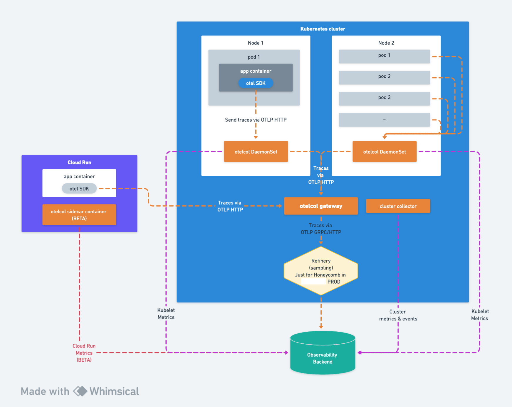

# k8s-opentelemetry-collectors-example
Example of opentelemetry collector instances on kubernetes. (Deployment, DeamonSet, ...).

The aim is to collect all kubernetes metrics useful beside the tracing instrumentation to reach a good observability state on a kubernetes platform.

NB: We use the `Honeycomb` vendor here but other open-source tools can be used (jaeger, zipkin etc)

We use the Opentelemetry operator's CRD to define these instances.

## DaemonSet & Cluster(deployment) collector
The aim of these collectors is to collect traces & global k8s metrics/logs:
- Nodes metrics
- Pods metrics
- Volume metrics
- k8s events (logs)

it is done via these receivers:
- [k8scluster](https://github.com/open-telemetry/opentelemetry-collector-contrib/tree/main/receiver/k8sclusterreceiver)
- [kubeletStatsMetrics](https://github.com/open-telemetry/opentelemetry-collector-contrib/tree/main/receiver/kubeletstatsreceiver)
- [k8sobjectsreceiver](https://github.com/open-telemetry/opentelemetry-collector-contrib/tree/main/receiver/k8sobjectsreceiver)

We then export the traces to our gateway collector. The otel metrics & logs are directly sent to **Honeycomb**

## Gateway Collector

This collector is used to collect all traces from the other collector instances, process them (batch, resourceDetection, transform etc) and send them to the vendors.
